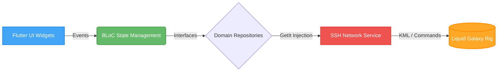

<div align="center">

# 🌌 Taj Mahal Orbit & L.G. Agentic Starter Kit

**A flawlessly stable, AI-guided controller for Liquid Galaxy.**

[](https://flutter.dev/)
[](https://dart.dev/)
[](https://deepmind.google/technologies/gemini/)
[](#)

*Built for the Gemini Summer of Code: Agentic Programming Contest.*

---
</div>

## 🛑 The Philosophy & The Choice

Developing for a multi-screen **Liquid Galaxy** rig is notoriously unforgiving. A single blocking SSH command on the main thread or a malformed KML string can cause frame drops, network desyncs, or completely freeze the physical rig.

When engineering this submission, time was strictly limited due to university examinations. Rather than rushing a complex, multi-feature application that might enter an unpredictable error state, a strict engineering choice was made: **Prioritize absolute reliability and build an unbreakable foundation.**

This repository serves as a two-fold submission:
1. **The Liquid Galaxy Agentic Starter Kit:** A highly scalable, Clean Architecture (BLoC + GetIt) engine.
2. **The Taj Mahal Orbit App:** A lightweight, focused proof-of-concept demonstration app that proves the underlying engine runs flawlessly.

---

## 🤖 The Agentic Virtual Team (The Secret Weapon)

This repository is more than just a Dart codebase. Living inside the `.agent/` folder is a **Virtual AI Engineering Team** powered by Google Gemini. 

To prevent the AI from hallucinating or generating rig-crashing code, the system is divided into 10 highly specialized skills. It enforces a strict 6-stage error-free development pipeline:

| Stage | Agent Name | Role in the Pipeline |
| :---: | :--- | :--- |
| 1️⃣ | 🏗️ `lg-init` | Scaffolds out feature folders with zero boilerplate. |
| 2️⃣ | 💡 `lg-brainstormer` | Designs dynamic 3D ideas tailored for the panoramic rig. |
| 3️⃣ | 🗺️ `lg-plan-writer` | Drafts a step-by-step markdown blueprint before any code is written. |
| 4️⃣ | ⚙️ `lg-exec` | Executes the blueprint safely, writing the complex Dart code. |
| 5️⃣ | 🧐 `lg-code-reviewer` | Audits the code for memory leaks and UI freezes before deployment. |
| 6️⃣ | 🎙️ `lg-quiz-master` | Quizzes the developer on their own code to ensure architectural comprehension. |

**🚨 The Emergency Brake:** The `lg-skeptical-mentor` autonomously halts workflows if a developer tries to skip steps, rush their code, or merge messy SSH logic directly into the UI.

---

## 🏗 System Architecture 

The codebase strictly enforces **Clean Architecture** and the **Dependency Inversion Principle (S.O.L.I.D)**. 

* **Dumb Views:** The UI layers (`features/dashboard/presentation/pages`) know nothing about IP addresses or connections.
* **App-Authoritative State:** The BLoC is the single source of truth. The rig screens are simply "dumb terminals" reflecting the BLoC's state.



---

## ✨ Core Features (Task 2 Ready)

Out of the box, the engine fulfills all baseline Liquid Galaxy capabilities:
* 🛡️ **Bulletproof SSH Client:** Managed via `dartssh2` with graceful timeout and exception handling (`lg_exception.dart`).
* 📍 **Dynamic KML Engine:** Heavy KML string formatting (`kml_generator.dart`) is offloaded to background threads.
* 🧹 **Rig State Management:** Built-in commands to instantly clear logos, wipe KMLs, and reset the view.
* ⚡ **Hardware Control:** Directly reboot, relaunch, or power-off the LG cluster from the tablet UI.

---

## 🚀 Getting Started

### Prerequisites
* Flutter SDK (3.19+)
* A physical Liquid Galaxy rig OR a virtual machine setup.
* A tablet or emulator to run the Flutter controller app.

### Quick Install

```bash
# 1. Clone the repository
git clone [https://github.com/shivharebhoomi07/Gemini_LGSK_Flutter-Wonder.git](https://github.com/shivharebhoomi07/Gemini_LGSK_Flutter-Wonder.git)

# 2. Enter the directory
cd Gemini_LGSK_Flutter-Wonder

# 3. Fetch dependencies
flutter pub get

# 4. Run the controller app
flutter run
```

### Connection Guide
1. Launch the app on your tablet.
2. Open the **Connection Settings** dashboard.
3. Input your Rig's **Master Node IP**, **Port** (default: 22), **Username**, and **Password**.
4. Tap **Connect** and initialize the Taj Mahal Orbit!

---

## 📁 Repository Structure

```text
/
├── .agent/                  # 🧠 The AI Virtual Engineering Team & strict rules
├── assets/                  # 🎨 Local KMLs and Logos
├── docs/                    # 📄 Architecture maps, feature blueprints, and AI reviews
├── lib/
│   ├── core/                # ⚙️ Global Toolkit (SSH Service, App Constants, Utilities)
│   ├── features/            # 🚀 Isolated App Features (Connection, Dashboard, etc.)
│   └── main.dart            # 🏁 App Entry Point & GetIt Injection
└── pubspec.yaml             # 📦 Dependencies
```

---

## 👨‍💻 About

**Built by Bhoomi Shivhare** *Submitted for the Gemini Summer of Code: Agentic Programming Contest.*

This architecture is intentionally simple, slow, and steady. My hope is that it empowers the next wave of students to build incredible open-source tools for Liquid Galaxy without having to spend weeks debugging memory leaks and SSH connections.
