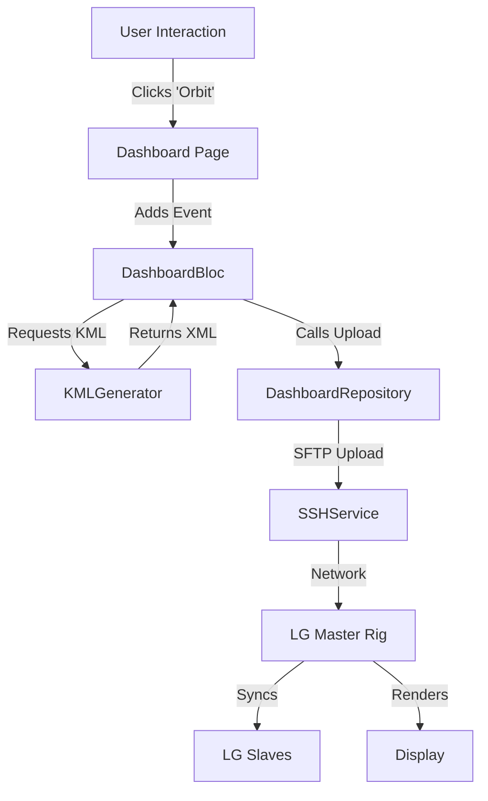

# Architecture Map

## Data Flow

## Component Roles
1.  **Presentation**: `lib/features/*/presentation` - Dumb widgets + Smart BLoCs.
2.  **Domain/Data**: `lib/features/*/data` - Business logic and device communication.
3.  **Core**: `lib/core` - Shared utilities (SSH, Constants, KML Math).